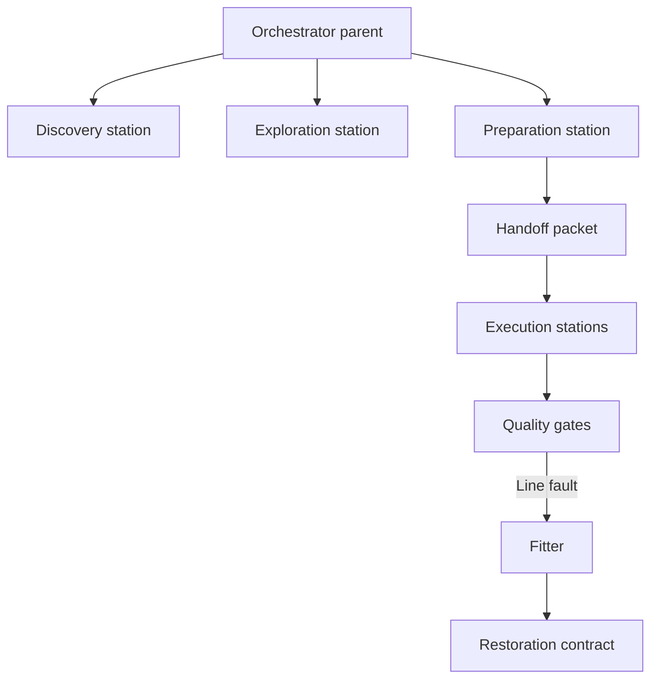

# Why Kilo Code

Station Kit (SK) is intentionally **Kilo Code-specific**.

This repo ships the workflow/contract layer (templates). Kilo Code provides the runtime capabilities that make those workflows executable and enforceable.

## What SK relies on from Kilo Code

SK’s “factory line” design assumes Kilo Code can:

1) **Run an Orchestrator parent that spawns subtasks**
- Parent task coordinates.
- Subtasks do isolated work in specialized roles.

2) **Define project-specific roles as custom modes**
- Modes are defined in [`templates/.kilocodemodes`](../templates/.kilocodemodes).
- Each mode controls tool access and file edit scope.

3) **Switch model/provider per role (per mode)**
- SK is “provider-neutral” in the sense that *you can experiment with model choice per station*.
- SK is not claiming “works in every agent runtime.” It is a Kilo workflow kit.

4) **Enforce tool boundaries per role**
- Example: Architect can plan, but not write product code.
- Example: Fitter focuses on workflow/runner health (not feature changes).

5) **Support MCP stations**
- Sequential thinking for reasoning continuity and session import/export.
- Codebase retrieval for fast semantic context.

## What SK provides (templates)

SK provides:

- **Workflows** (invoked as slash commands) under [`templates/.kilocode/workflows/`](../templates/.kilocode/workflows/)
- **Contracts** (explicit artifacts passed between stations) under [`templates/.kilocode/contracts/`](../templates/.kilocode/contracts/)
- **Mode definitions** aligned to the workflow suite under [`templates/.kilocodemodes`](../templates/.kilocodemodes)
- **Beads operator contract** under [`templates/AGENTS.md`](../templates/AGENTS.md)

## The factory-line pattern (at a glance)

For concrete workflow definitions, see:
- [`templates/.kilocode/workflows/orchestrate-start-task.md`](../templates/.kilocode/workflows/orchestrate-start-task.md)
- [`templates/.kilocode/workflows/orchestrate-execute-task.md`](../templates/.kilocode/workflows/orchestrate-execute-task.md)

## What this is not

SK is not:

- a generic multi-agent framework
- an IDE copilot
- a hosted coding agent

It is a **workflow + contract kit** designed to be executed inside Kilo Code.
